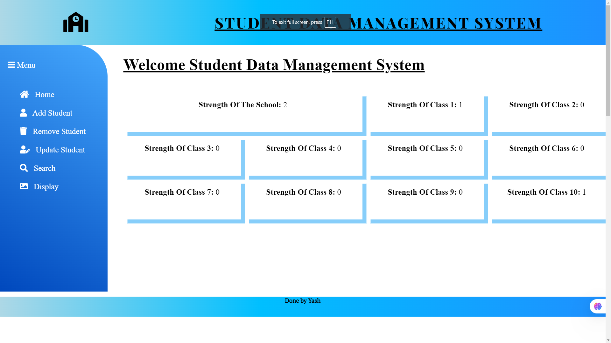

# Student Data Management System [Link](https://student-data-management-ebon.vercel.app/)

## Overview
The **Student Data Management System** is a web application built using **Python Django**, **HTML**, **CSS**, and **JavaScript**. It provides a user-friendly interface to manage student records with complete **CRUD (Create, Read, Update, Delete)** functionality, making data management efficient and streamlined.

---

## Features

- **CRUD Operations**
  - **Create**: Add new student details.
  - **Read**: Display student details in a structured format.
  - **Update**: Modify existing student records.
  - **Delete**: Remove a student's details from the database.

- **Responsive Design**
  - Designed with a mobile-first approach to ensure usability on all devices.

- **Data Validation**
  - Validates user inputs to maintain data accuracy and integrity.

- **Search Functionality**
  - Quickly search and filter students using various parameters.

---

## Screenshots

### Home


### Add Student


### Remove Student


### Update Student


### Search


### Display


---

## Getting Started

Follow these steps to set up and run the project locally:

1. **Clone the Repository**  
   ```bash
   git clone https://github.com/yashpatle23/student_data_management.git
   ```
   
2. **Navigate to the Project Directory**  
   ```bash
   cd student-data-management
   ```

3. **Install Dependencies**  
   Make sure you have Python installed, then run:  
   ```bash
   pip install -r requirements.txt
   ```

4. **Apply Migrations**  
   Initialize the database with the necessary tables:  
   ```bash
   python manage.py migrate
   ```

5. **Run the Development Server**  
   Start the server and access the application in your browser:  
   ```bash
   python manage.py runserver
   ```
   Visit [http://localhost:8000](http://localhost:8000) in your browser.

---

## Contributing

Contributions are welcome! If you would like to improve this project, please follow these steps:

1. Fork the repository.
2. Create a new branch (`git checkout -b feature-branch`).
3. Commit your changes (`git commit -m "Add some feature"`).
4. Push to the branch (`git push origin feature-branch`).
5. Open a pull request.

---

## License

This project is licensed under the [MIT License](LICENSE).

---


Happy Coding! 🎉
```
